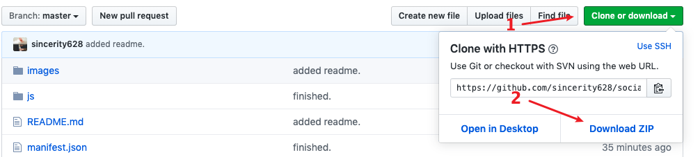
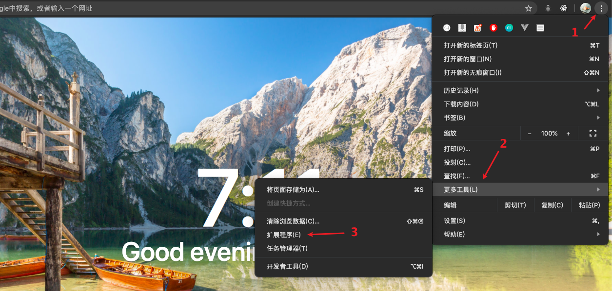
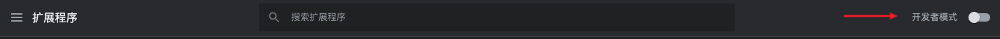
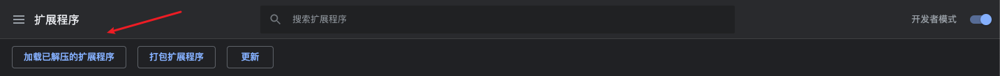
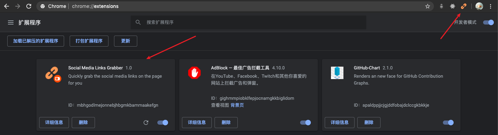

### Social Media Links Grabber

一个获取网页底部媒体社交链接的谷歌浏览器插件。

---

#### 插件截图：

#### 使用方法

- 下载项目 ZIP 文件，解压。

- 打开 chrome 浏览器，依次点击浏览器右上角菜单标志，然后鼠标悬浮在“更多工具”上，找到“扩展程序”并点击。

- 右上角打开“开发者模式”

- 点击“加载已解压的扩展程序”，直接导入刚才下载并解压好的文件即可。

- 导入成功

